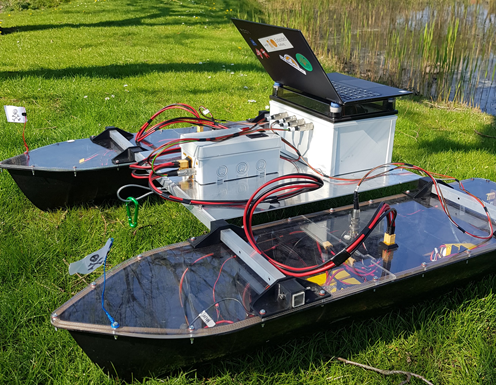
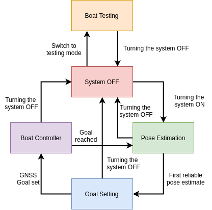
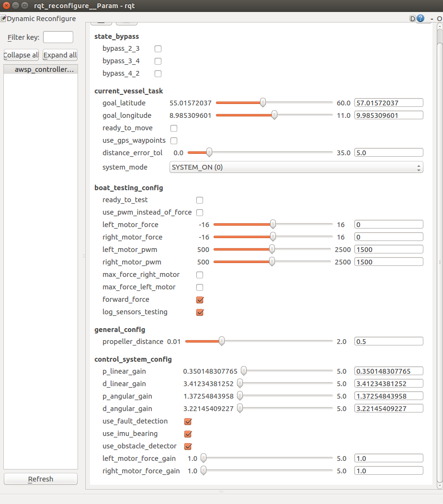

# awsp_ros



This repository is a collection of interdependent packages purposefully built for the 5th and 6th semester robotics semester project. All the packages are meant to be used as a singular ROS workspace. The bulk of the work was done during the 6th semester.

The current state of the workspace implements the control structure as different subsystems. The image below shows this structure.


# Getting started
This guide assumes that you have already install the `catkin` environment for `ROS Kinetic`. Else, follow [this installation guide](http://wiki.ros.org/catkin#Installing_catkin).


You'll have to initialize a workspace, you can choose to do it manually:
```shell
source /opt/ros/kinetic/setup.bash
mkdir -p ~/<catkin_ws_name>/src
cd ~/<catkin_ws_name>/
catkin_make
source devel/setup.bash
```

Then, you just need to replace the content of the `<catkin_ws_name>/src` directory with the `awsp_ros`. To do that just run:
```shell
cd <catkin_ws_name>
rm -r src/
git clone https://github.com/dmicha16/awsp_ros.git
mv awsp_ros/ src/
catkin_make
```

OR, you can do it by running the script [setup_awsp_ws.sh](https://github.com/dmicha16/awsp_ros/blob/master/awsp_scripts/setup_awsp_ws.sh)
by typing `./setup_awsp_ws.sh` into the terminal. This script will create everything for you right away.

## Understanding the software stack
This image shows the currently implemented software stack. Everything except the hardware interfaces can be found in this repository. The vessel is driven using the core navigation nodes, which are reliant on the sensor interfaces and on the miscellaneous libraries.


The main entry point of the workspace is in the controller node. This controller node is built around a state machine. This state machine has been thoroughly descibred in the report made for this project, so little documentation can be found here about the workings. However, here is a graph which the states and the inputs which switch state.



This state machine is purpose built to serve as the backend to the reconfigure gui. (See below). The complementary libraries and hardware interfaces used are also explained below.


## Using the launch files

### Controller
A set of different launch files have been created to run the system. Currenlty, the main entry point of the project is at the controller node. It is possible to run this node without any of the sensor interfaces. To do so, source the workspace and type `roslaunch  awsp_launch  awsp_launch_controller.launch`. To run the controller and the corresponding sensors interfaces, type `roslaunch awsp_launch awsp_launch_full.launch`

### Pose estimator
Similarly, to run the pose estimator, type `roslaunch awsp_launch awsp_launch_pose_est.launch`

### Obstacle avoidance

And to run the obstacle avoidance node, use `roslaunch awsp_launch awsp_launch_path_planner.launch`

## Running the dynamic reconfigure GUI

There is an extensive ROS dynamic reconfigure gui implemented into the system. This gui can be run remotelty utalizing the inbuilt ROS multi-device capabilites. There are several steps to follow to run this gui:

1) You'll need to setup ROS to work on multiple devices, one being the Pi inside the vessel and the other is the remote PC. Follow this tutorial to set this functionality up: [ROS/Tutorials/MultipleMachines - ROS Wiki](http://wiki.ros.org/ROS/Tutorials/MultipleMachines). There is a script included to setup the addresses on the Pi automatically: [awsp_ros/setup_ros_server.sh at master · dmicha16/awsp_ros · GitHub](https://github.com/dmicha16/awsp_ros/blob/master/awsp_scripts/setup_ros_server.sh)
2) Run the dynamic reconfigure gui on the PC by typing `rosrun rqt_reconfigure rqt_reconfigure`.
3) Run the launch file: `roslaunch awsp_launch awsp_launch_full.launch` OR `roslaunch awsp_launch awsp_launch_pose_est.launch`. There is a dynamic reconfigure setup for both of these nodes at the same time.
4) Once thee system is initialized, use the GUI to launch functionalities.




# ROS topics published
Messages published by the system are as follows:

[awsp_ros/CartesianError.msg](https://github.com/dmicha16/awsp_ros/blob/master/awsp_msgs/msg/CartesianError.msg)
Publishes the current cartesian error towards the goal point. This only happens when the path planner has recieved the goal coordinates. 

[awsp_ros/CurrentState.msg](https://github.com/dmicha16/awsp_ros/blob/master/awsp_msgs/msg/CurrentState.msg)
Publish the EKF current state estimates of the vessel. Including, local x and y coordainates, velocity and current bearing.

[awsp_ros/GnssData.msg](https://github.com/dmicha16/awsp_ros/blob/master/awsp_msgs/msg/GnssData.msg)
All the data from the GNSS module.

[awsp_ros/GoalCoordinates.msg](https://github.com/dmicha16/awsp_ros/blob/master/awsp_msgs/msg/GoalCoordinates.msg)
Goal coordinates in the system if only a singlar has been selected from the GUI. It also publishes a boolean if waypoints are selected instead of a single goal point.

[awsp_ros/Gy88Data.msg at master](https://github.com/dmicha16/awsp_ros/blob/master/awsp_msgs/msg/Gy88Data.msg)
All the data from the IMU.

[awsp_ros/MotorStatus.msg](https://github.com/dmicha16/awsp_ros/blob/master/awsp_msgs/msg/MotorStatus.msg)
Status of the motors. Only published if there is force/PWM applied. Also tells you whether the ESCs are alive and can be used.

[awsp_ros/ObstacleData.msg](https://github.com/dmicha16/awsp_ros/blob/master/awsp_msgs/msg/ObstacleData.msg)
Distance to obstacle and a boolean whether the obstacle is evaluated to exist.

[awsp_ros/StateMachineStatus.msg](https://github.com/dmicha16/awsp_ros/blob/master/awsp_msgs/msg/StateMachineStatus.msg)
Current state of the state machine. Published every time there is a change.


## Complementary software requirements

[PIGPIO Daemon](http://abyz.me.uk/rpi/pigpio/pigpiod.html) - Time was not devoted to develop a PWM conversion library for the ESCs which run the motor, therefore, this library is used to replace that functionality. To be sure you can run the motors with the firmware, you have to run this daemon before by typing `sudo pigpiod` into one of your open terminals.

[WiringPi](http://wiringpi.com/) - Interfaces to the sensors ([awsp_ros/awsp_gnss_l86_interface](https://github.com/dmicha16/awsp_ros/tree/master/awsp_gnss_l86_interface), [awsp_ros/awsp_gy_88_interface](https://github.com/dmicha16/awsp_ros/tree/master/awsp_gy_88_interface) & [awsp_ros/awsp_obstacle_detector](https://github.com/dmicha16/awsp_ros/tree/master/awsp_obstacle_detector)) are built around wiringPi. It is a requirement to have this interface installed to be able to connenct the sensors.

[rohbotics/pifi: A headless wifi provisioning system.](https://github.com/rohbotics/pifi) - The current distro used for this project, automatically creates a hotspot a randomized name. Using this library it is possible to set default wifi netoworks onto which the Pi would connect.


# Notes

The repo hosts a variety of packages originally developed standalone. This repo was created to unify and sync these packages into one, coherent ROS workspace. If you wish to use these packages standalone visit the links below.

You can find these repos here:
- [partesian_pose](https://github.com/EduPonz/cartesian_pose)
- [gnss_l86_interface](https://github.com/EduPonz/gnss_l86_interface)
- [catamaran_controller](https://github.com/IvelinPenchev/catamaran_controller)
- [gy_88_interface](https://github.com/dmicha16/gy_88_interface)
- [ros_sensor_filter_kit](https://github.com/dmicha16/ros_sensor_filter_kit)


