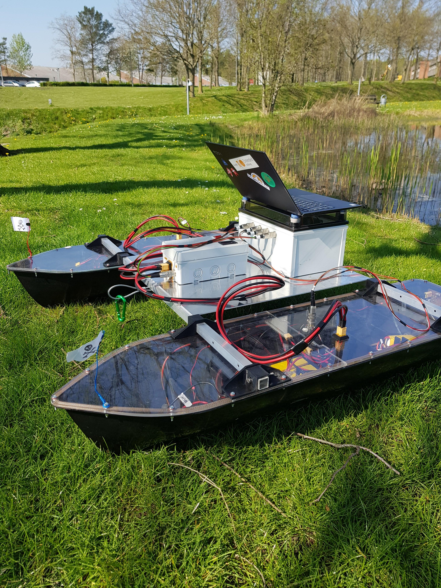
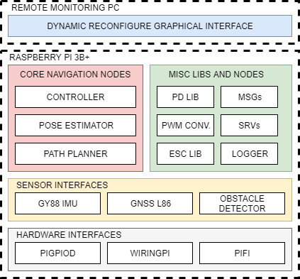

# awsp_ros



This repository is a collection of interdependent packages purposefully built for the 5th and 6th semester robotics semester project. All the packages are meant to be used as a singular ROS workspace. The bulk of the work was done during the 6th semester.

The current state of the workspace implements the control structure as different subsystems. The image below shows this structure.


# Getting started
This guide assumes that you have already install the `catkin` environment for `ROS Kinetic`. Else, follow [this installation guide](http://wiki.ros.org/catkin#Installing_catkin).


You'll have to initialize a workspace, you can choose to do it manually:
```shell
source /opt/ros/kinetic/setup.bash
mkdir -p ~/<catkin_ws_name>/src
cd ~/<catkin_ws_name>/
catkin_make
source devel/setup.bash
```

Then, you just need to replace the content of the `<catkin_ws_name>/src` directory with the `awsp_ros`. To do that just run:
```shell
cd <catkin_ws_name>
rm -r src/
git clone https://github.com/dmicha16/awsp_ros.git
mv awsp_ros/ src/
catkin_make
```

OR, you can do it by running the script [setup_awsp_ws.sh](https://github.com/dmicha16/awsp_ros/blob/master/awsp_scripts/setup_awsp_ws.sh)
by typing `./setup_awsp_ws.sh` into the terminal. This script will create everything for you right away.

## Using the launch files

### Controller
A set of different launch files have been created to run the system. Currenlty, the main entry point of the project is at the controller node. It is possible to run this node without any of the sensor interfaces. To do so, source the workspace and type `roslaunch awsp_controller awps_controller_minimal.launch`. To run the controller and the corresponding sensors interfaces, type `roslaunch awsp_controller awsp_controller_full.launch`

### Pose estimator
Similarly, to run the pose estimator, type `roslaunch awsp_controller awsp_controller_limited.launch`

### Obstacle avoidance

And to run the obstacle avoidance node, use `rosrun awsp_obstacle_detector awsp_obstacle_detector_node`

## Running the dynamic reconfigure GUI


# ROS messages and services

## Complementary software requirements




[PIGPIO Daemon](http://abyz.me.uk/rpi/pigpio/pigpiod.html) - Time was not devoted to develop a PWM conversion library for the ESCs which run the motor, therefore, this library is used to replace that functionality. To be sure you can run the motors with the firmware, you have to run this daemon before by typing `sudo pigpiod` into one of your open terminals.

[WiringPi](http://wiringpi.com/) - Interfaces to the sensors ([awsp_ros/awsp_gnss_l86_interface](https://github.com/dmicha16/awsp_ros/tree/master/awsp_gnss_l86_interface), [awsp_ros/awsp_gy_88_interface](https://github.com/dmicha16/awsp_ros/tree/master/awsp_gy_88_interface) & [awsp_ros/awsp_obstacle_detector](https://github.com/dmicha16/awsp_ros/tree/master/awsp_obstacle_detector)) are built around wiringPi. It is a requirement to have this interface installed to be able to connenct the sensors.

[rohbotics/pifi: A headless wifi provisioning system.](https://github.com/rohbotics/pifi) - The current distro used for this project, automatically creates a hotspot a randomized name. Using this library it is possible to set default wifi netoworks onto which the Pi would connect.


# Notes

The repo hosts a variety of packages originally developed standalone. This repo was created to unify and sync these packages into one, coherent ROS workspace. If you wish to use these packages standalone visit the links below.

You can find these repos here:
- [partesian_pose](https://github.com/EduPonz/cartesian_pose)
- [gnss_l86_interface](https://github.com/EduPonz/gnss_l86_interface)
- [catamaran_controller](https://github.com/IvelinPenchev/catamaran_controller)
- [gy_88_interface](https://github.com/dmicha16/gy_88_interface)
- [ros_sensor_filter_kit](https://github.com/dmicha16/ros_sensor_filter_kit)

